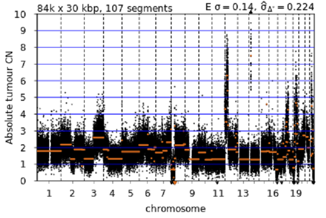
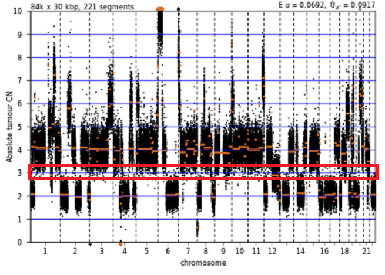
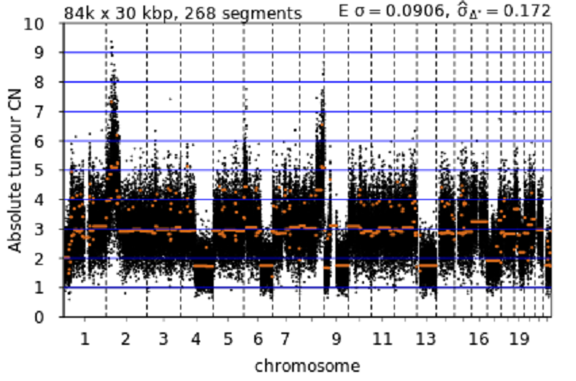
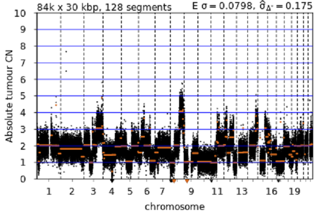
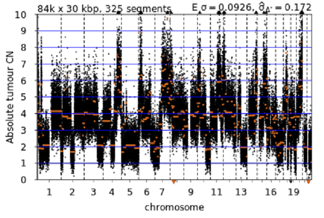
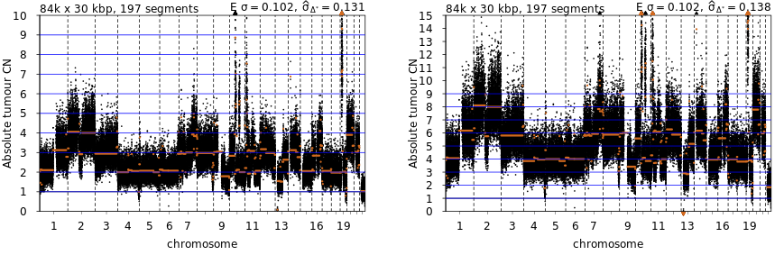
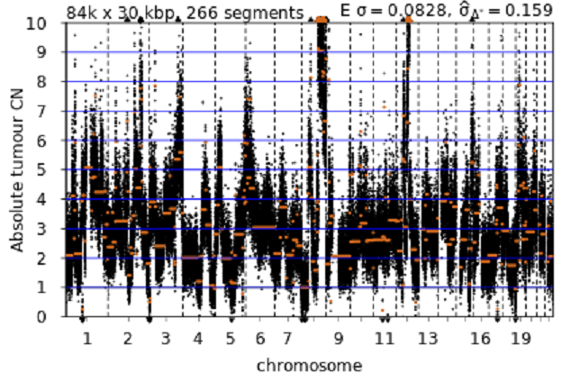

# Quality control guide

- [Introduction](#introduction)
	- [Selection features](#selection-features)
		- [Quantitative features](#quantitative-features)
			- [Expected _TP53_ allele frequency](#expected-tp53-allele-frequency)
			- [Clonality error parameter](#clonality-error-parameter)
			- [Purity](#purity)
			- [Ploidy](#ploidy)
		- [Qualitative features](#qualitative-features)
			- [Non-integer segments](#non-integer-segments)
				- [Unfitted copy number segments](#unfitted-copy-number-segments)
				- [Tumour heterogeneity](#tumour-heterogeneity)
			- [Interleaving copy states](#interleaving-copy-states)
			- [Over-segmentation](#over-segmentation)
			- [Compressed profile fits](#compressed-profile-fits)
			- [Segment noise](#segment-noise)
	- [Application of selection features](#application-of-selection-features)

## Introduction

 While the fitting process removes many fits that are poor quality or unlikely to be acceptable, each sample is likely to have more than one potential acceptable fit associated with it (output in the file `{project}_fit_QC_predownsample.tsv`). This requires the selection of a single best fit, or exclusion of all fits, for each sample.

### Selection features

Quality control of potential copy number profile fits can be split into two categories, quantitative and qualitative. Quantitative features are those numeric values which indicate a given fit is of greater quality than another, while qualitative features are visual patterns identified by inspection of copy number profile plots.

#### Quantitative features

##### Expected _TP53_ allele frequency

__ONLY APPLICABLE TO SAMPLES WITH SOMATIC HOMOZYGOUS _TP53_ MUTATIONS__

In samples with available somatic _TP53_ mutation allele frequency data, the calculated variant allele fraction (VAF) for a homozygous _TP53_ variant is a result of the combination of the purity and ploidy of the sample. For a given sample, the absolute copy number segment for _TP53_ can be extracted and an expected VAF calculated for a homozygous variant.

A comparison can therefore be made between the experimental _TP53_ VAF and the expected _TP53_ VAF for a given purity-ploidy combination. Fits where the experimental and expected VAFs are closer is suggestive of a better fit that corresponds with the actual underlying copy states in the sample.

By default, copy number profile fits with VAF differences of greater than 0.15 are excluded and not considered (this does not apply to samples where _TP53_ VAF is not available). This can be changed to a given threshold by altering the `af_cutoff` value in the `config/config.yaml` file in the git repository.

From the `{project}_fit_QC_predownsample.tsv` file, for each fit, compare the value from `expected_TP53_AF` to the `TP53_freq` value. As a guide, absolute differences between the two values of less than `0.03` are considered essentially identical outcomes, with differences of `0.03`-`0.05` being considered relatively good fits. Fits with values between `0.05`-`0.15` are generally considered poorer but tenable in combination with other selection features.

##### Clonality error parameter

The clonality value is an error parameter that measures how well segments align to integer copy states, where lower values indicate segments in a given fit align on or closer to an integer state across the sample. It is important to consider that while the clonality error parameter can indicate a poorly fitted profile, where segments fail to align to integer copy state, it is also influenced by [tumour heterogeneity](#tumour-heterogeneity) and [segment noise](#segment-noise).

Because clonality is a measure of distance from integer copy state, it is calculated as a mean of difference between unrounded copy state and rounded copy state, as such there is an upper limit applied to clonality of 0.5 (though this is essentially impossible to fit on a real profile). As a guide, users can tier the clonality values where low clonality values between `0`-`0.1` generally correspond with a good fit, values between `0.1`-`0.2` constitute a moderate fit, and values greater than `0.2` are typically poor.

##### Purity

Purity of a copy number profile fit is an important metric to assess for any given sample. For any given sample, extreme purity values can be indicative of a poor fit.

In bulk tumour samples, excessively high purity values (`0.95` or greater) can be poor fits that fail to account for normal tissue contamination and fit tumour segments at incorrect copy number states. This inference is not applicable to non-tumour samples, such as cancer cell lines, where a pure sample is expected.

Conversely, fits at low purity values (`0.3` or less) can be unreliable and profiles fit at these purity values require a more detailed analysis to confirm the integrity of the fit. Additionally, at low purities, copy number profiles can result in the accidental fitting of the copy states of the normal cells within a sample. This is easily identified as a flat copy number profile with no copy number alterations.

##### Ploidy

Ploidy of a copy number profile fit is quantitative feature to assess while determining the suitability of a fit. Extreme ploidy values (greater than `6` or less than `1.8`) can indicate a poor or noisy fit. High ploidy fits can contain a high degree of non-integer segments whereas low ploidy fits may indicate a compressed copy number profile or a unsustainable proportion of homozygous loss across the genome.

#### Qualitative features

##### Non-integer segments

In fitting copy number profiles, a proportion of segments will fail to align with an exact integer copy number state. This deviation from integer state is attributable to several factors, including biological and fitting errors, such as noise, tumour heterogeneity, and incorrect fitting of copy number segments. Determining the difference between these features in a copy number profile will aid in selecting or excluding a fit.

###### Unfitted copy number segments

Multiple segments, across multiple chromosomes, at a fixed or similar non-integer copy number state is suggestive of a failure for a copy number profile to be fitted at the correct ploidy or purity combination. For most cases, a specific copy state will align with a integer copy state, with additional copy states alternating between integer and non-integer states.

In these cases, it is likely that the correct fit is either at a lower or higher ploidy state which can be determined by multiplying or dividing the value of the non-integer states to an integer state and applying that scaling to all other segments.

###### Tumour heterogeneity

Tumour heterogeneity is identified in a copy number profile as non-integer segments where the value of non-integer segments are not a consistent value, nor are the segments at a consistent value across chromosomes. These segments can also be seen as step-wise alterations in the segment values.

##### Interleaving copy states

Profiles are expected to have interleaving copy states (non-zero segment counts on all integer copy number states at diploid or higher) and the presence of non-interleaving copy states is indicative of a poor fit. On a copy number profile, this manifests as a copy state skipping pattern.

The exclusion of these fits is due to the biological improbability of a given sample undergoing an event such as whole genome duplication without then having any heterozygous loss of any other genomic regions and only homozygous losses.

##### Over-segmentation

A profile feature that is a result of over-segmentation by circular binary segmentation in which false segments are introduced to a profile. While some over-segmentation is tolerable, excess over-segmentation will impact fit quality and downstream analysis such as copy number signature derivation.

Over-segmentation can be identified in a profile through the presence of small random segments distributed across the genome.

##### Compressed profile fits

In certain instances, profiles may present as being compressed, in which a fit a forced to a ploidy state that is too low. This results in the compression of segments into a smaller copy number state range. These profiles are likely underpowered and would fit to higher ploidy states if more sequencing reads were available.

##### Segment noise

Segment noise, despite its name, is not a description of the noise of segments themselves but the vertical distribution of the underlying bin data point clouds that are used to segment the profiles. High noise across segments might indicate a poor fit at a higher ploidy than expected, opposite to the compressed noise fit described earlier. High segment noise will also result in segments drifting away from integer states but are not necessarily poor fits.

High noise on its own is not sufficient to remove a profile but can support and contribute to the inclusion or exclusion of a given profile in conjunction with the other factors described herein.

### Application of selection features

In deciding whether to include or exclude a absolute copy number profile for a given sample, some features described above can be used independently (such as non-interleaving copy states) but most will need to be used collectively to form a list of evidences that either support or negate the viability of a fit.

It is good practice to make extensive use of the `notes` field of the `{project}_fit_QC_predownsample.tsv` to list features and how they impact the quality of a fit.

###### Example 1

In this example the `notes` field lists the selection features present and this collection of evidence was used to conclude whether or not to include the fit. Here the `notes` field states:

* lowest clonality
* close o/eTP53
* higher ploidy fit non-interleaving

It can be seen in this example that the first fit (left image) has a lower clonality (`0.093` vs. `0.146`), the experimental and expected _TP53_ VAF are close (`0.966` vs. `0.990`), and that the higher ploidy fit (right image) has non-interleaving copy states. As such, the fit corresponding to the left image for this sample is selected as a correct absolute fit and all other potential fits for this sample are excluded.

###### Example 2

In this example, only a single ploidy-purity combination passed the automated filtering process. Here the `notes` field states:

* matching o/eTP53
* high clonality
* high noise
* many non-integer segments

For this sample, it is first noted that the experimental and expected _TP53_ VAF are matching (`0.526` vs. `0.542`), which would suggest a good profile, but additional quantitative and qualitative features counter that evidence. In this case the quantitative feature is the clonality error parameter which is `0.210`, a value considered to be high and an indicator of a poor fit. From visual inspection of the fit it can be observed that the profile also contains a high degree of segment noise, with segment data clouds spanning vertically across the entire plotting space. Lastly is the observation that the fit contains a large number of non-integer segments at multiple copy number states, with only a small fraction of segments aligning to integer copy states. As such, this sample was excluded as no suitable fit was identified.
