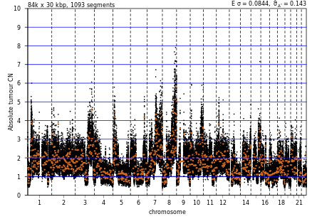
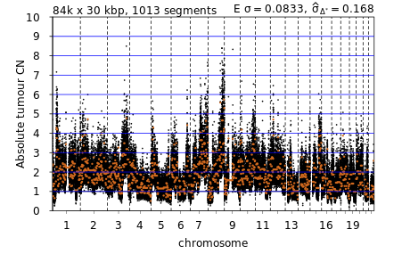

## Smoothing guide

In most cases, no prior information on whether the boolean `smooth` column in the `samplesheet.tsv` should contain a `TRUE` or `FALSE` for each sample and so by default should be set to `FALSE`. For most samples, smoothing is not required but oversegmentation issues and data-specific factors mean that a subset of samples will likely require smoothing to be performed and as such `smooth` to be set to `TRUE`.

To perform an assessment of which samples require smoothing, plots generated in stage 1 can be visually assessed. The files are outuput into the directory `{output_dir}/sWGS_fitting/{project}_{bin}kb/absolute_PRE_down_sampling/plots/` where `output_dir`, `project`, and `bin` corespond to the values set when the pipeline was run.

Additionally, assessing the total number of called segments (annotated above each copy number profile plot) can be a reasonable indicator with excessive segment calls indicating both a poor fit and a need to smooth a given sample, though this will be tissue/cancer specific and less reliable than visual inspection. To provide some context for which samples do or do not need smoothing, the images below are examples of ovarian cancer copy number profiles which would benefit from having smoothing applied.

Samples with copy number fits resembling the fits shown above should most likely require smoothing and should have the `smooth` boolean in the `samplesheet.tsv` updated. This process is manual and requires the table initially used for the pipeline to be altered and saved. Alternatively, a copy of the original `samplesheet.tsv` could be edited and the new `samplesheet.tsv` provided by rerunning the `update_configs.py` script, as described in step 4.

Changing the `smooth` boolean should be simple but for demonstration using the example `samplesheet.tsv`, if the sample labelled `SAM1` was determined to require smoothing then the orignial table would be altered from:

|PATIENT_ID|SAMPLE_ID|TP53freq|smooth|file         |
|----------|---------|--------|------|-------------|
|PAT1      |SAM1     |0.45    |FALSE |/data/SAM1.bam|
|PAT1      |SAM2     |0.55    |FALSE |/data/SAM2.bam|

to the following

|PATIENT_ID|SAMPLE_ID|TP53freq|smooth|file         |
|----------|---------|--------|------|-------------|
|PAT1      |SAM1     |0.45    |TRUE  |/data/SAM1.bam|
|PAT1      |SAM2     |0.55    |FALSE |/data/SAM2.bam|

After updating the `smooth` boolean for all samples requiring smoothing, rerun stage 1 using the newly edited `samplesheet.tsv` as described in step 6.
